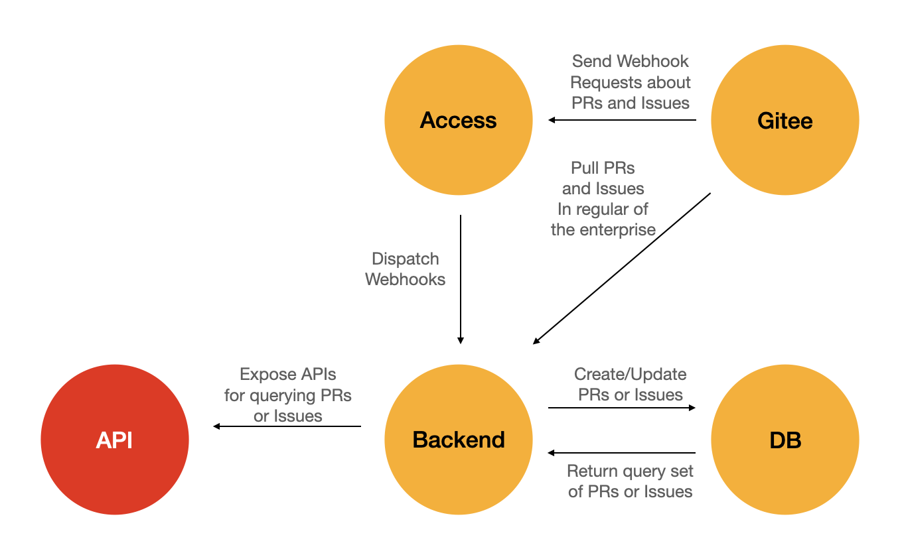

## openEuler community PR and Issue synchronization services

### service framework
This service applies two ways (scheduled task and triggered by Gitee Webhook) to synchronize the status of PR and Issue in the openEuler community, 
and provides the REST API for querying the list of  PR and Issue.

service framework

### Data synchronization
- Scheduled task 
  Obtain the list of Pulls or Issues of the enterprise, check whether the record of each Pull or Issue exists in the database by using the link of Pull or Issue,
  update it if the record exists, otherwise create it in database.
- Triggered by Gitee WebHook 
  When there are the PR's or Issues's related webhook event in Gitee repositories, Access will dispatch the webhooks to the Backend of the service,
  Backend will parse the requests and check whether the record of each Pull or Issue exists in the database by using the link of Pull or Issue,
  update it if the record exists, otherwise create it in database. 

### Data Query
Query supports full query, keyword query, sorting, etc
