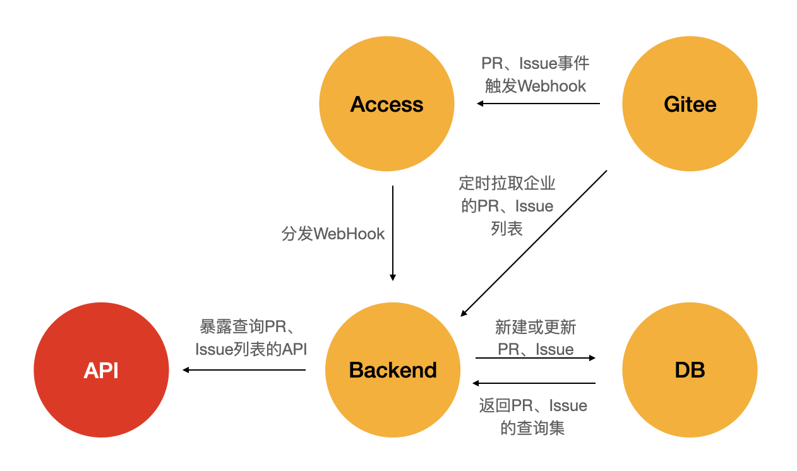

## openEuler社区PR、Issue同步服务

### 服务框架
本服务支持通过定时拉取和Gitee WebHook触发两种方式，
同步社区的PR、Issue的状态，并提供了查询PR、Issue列表的API。

服务框架

### 数据同步
- 定时拉取
  获取企业的Pull（或Issue）列表，通过各个Pull（或Issue）的链接查询该Pull（或Issue）记录是否在数据库中存在，存在则更新其状态，不存在则新增一条记录。
- Gitee WebHook触发
  当Gitee仓库有PR、Issue相关事件时会触发WebHook，通过Access可将WebHook转发到Backend，Backend解析请求后通过Pull（或Issue）的链接查询该Pull（或Issue）记录是否在数据库中存在，存在则更新其状态，不存在则新增一条记录。

### 数据查询
列表查询支持全量查询以及关键字查询，排序等